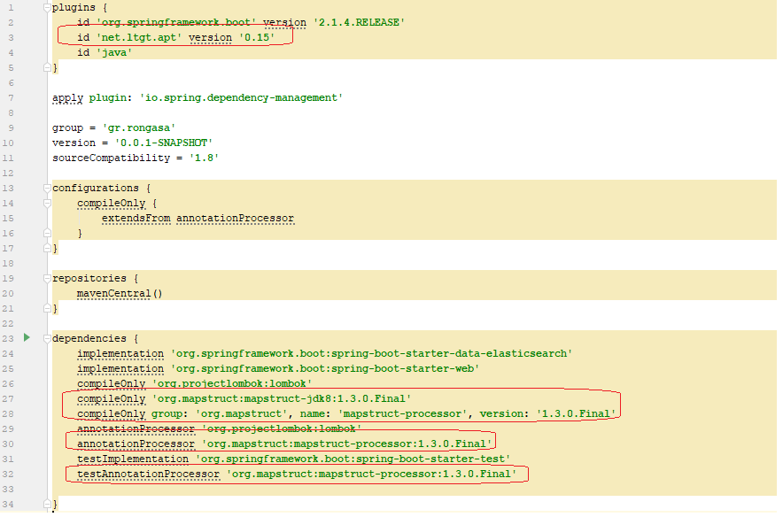

# Exercise Solution

## Setting up the project step by step

Use Spring Initialzr, to setup the project.  You need to add the following dependencies:

1. Web
2. Elasticsearch
3. Lombok

---


---

Open the project with Intellij and setup the support of lombok

* Install lombok plugin

* For the current project enable annotation processors


* Open build.gradle and add mapstruct support

---



---


* Next step is to create the desired package structure

* Create the domain object and add the lombok and elastic search annotations

   ```java
   package gr.rongasa.library.domain;
   
   import lombok.AllArgsConstructor;
   import lombok.Getter;
   import lombok.NoArgsConstructor;
   import lombok.Setter;
   import org.springframework.data.annotation.Id;
   import org.springframework.data.elasticsearch.annotations.Document;
   
   @Document(indexName = "resource")
   @AllArgsConstructor
   @NoArgsConstructor
   @Getter
   @Setter
   public class Resource {
       @Id
       private String trackingId;
       private String type;
       private String name;
       private String author;
       private String description;
       private String url;
   }
   ```

---

* Create the DTO/view object

   ```java
   package gr.rongasa.library.web.dto;
   
   import com.fasterxml.jackson.annotation.JsonIgnoreProperties;
   import com.fasterxml.jackson.annotation.JsonProperty;
   import lombok.AllArgsConstructor;
   import lombok.Getter;
   import lombok.NoArgsConstructor;
   import lombok.Setter;
   import org.springframework.data.annotation.Id;
   import org.springframework.data.elasticsearch.annotations.Document;
   
   import javax.validation.constraints.NotEmpty;
   
   @AllArgsConstructor@NoArgsConstructor
   @Getter
   @Setter
   @JsonIgnoreProperties(ignoreUnknown = true)
   public class ResourceDTO {
       @NotEmpty
       @JsonProperty("tracking_id")
       private String trackingId;
       private String type;
       private String name;
       private String author;
       @JsonProperty("abstract")
       private String description;
       private String url;
   }
   
   ```
---

   Notice: Here it is a proper place for input validation and also desired json naming (check the json, you cannot use the word abstract but in the dto you can add an annotation specifying the desired name. Same applies with tracking_id)

* Now add the mapping between the database entity and the view DTO objects.

   * [mapstruct](http://mapstruct.org/)

   * [Simple mapstruct tutorial](https://www.baeldung.com/mapstruct)

   * [Yet annother simple mapstruct tutorial](https://sharing.luminis.eu/blog/object-mapping-magic-with-mapstruct/)
   

   > Note: I thought it is good idea to introduce a good practice here. If using mapstruct becomes too complex please feel free to skip this task.

   
---

* Create the spring data repository enabling database query access.

   At this point you will need to setup elasticsearch connection in application properties

* Create the service which retrieves database entities, converts these to data transfer objects and provides these to the caller bean.

* Create the Rest controller and provide the required rest interface.

* Start your application and use postman to troubleshoot possible issues. 